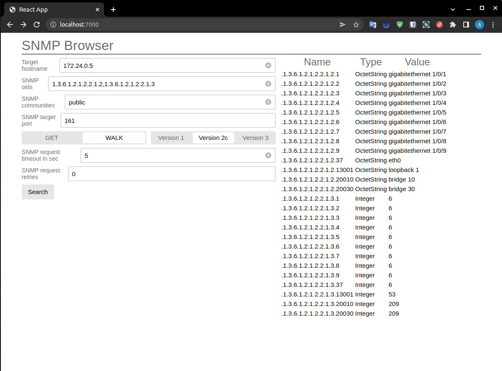

# snmp-browser

- [snmp-browser](#snmp-browser)
  - [Docker hub](#docker-hub)
  - [Описание](#описание)
  - [Цели](#цели)
  - [Как собрать](#как-собрать)
  - [Встроенная помощь в запуске](#встроенная-помощь-в-запуске)
  - [Как запустить](#как-запустить)
    - [Web](#web)
    - [CLI](#cli)



## Docker hub

https://hub.docker.com/repository/docker/hegemonies/snmp-browser

## Описание

snmp-browser - это приложение предназначенный для быстрого и легкого тестирования SNMP через cli или web интерфейс.

[Техническое задание бэкенда](server/technical_specification.md)

[README фронтенда](frontend/README.md)

## Цели

- [x] Поддержка SNMP GET в cli интерфейсе
- [x] Поддержка SNMP GET в web интерфейсе
- [x] Поддержка SNMP WALK в cli интерфейсе
- [x] Поддержка SNMP WALK в web интерфейсе
- [x] Поддержка SNMP Version 2c в cli и web интерфейсах
- [x] Поддержка мульти SNMP OID'ов в cli и web интерфейсах
- [x] Поддержка мульти SNMP Community в cli и web интерфейсах
- [x] Поддержка таймаутов запросов в cli и web интерфейсах
- [x] Поддержка повторных запросов в cli и web интерфейсах
- [x] Поддержка HTTP протокола в web интерфейсе
- [ ] Поддержка WebSocket протокола в web интерфейсе
- [ ] Поддержка сортировки таблицы в web интерфейсе
- [ ] Поддержка пагинации таблицы в web интерфейсе
- [ ] Поддержка вывода времени выполнения запроса в web интерфейсе
- [ ] Поддержка адаптивного web интерфейса
- [ ] Поддержка SNMP TRUP
- [ ] Поддержка SNMP SET команды

## Как собрать

Чтобы собрать проект все в одном (фронтенд и бэкенд) в докере:

```bash
make build-all-docker
```

Чтобы собрать все в одном (фронтенд и бэкенд):
```bash
make build-all
```

Чтобы собрать только бэкенд:

```bash
make -C server/golang build
```

Чтобы собрать только бэкенд в docker:

```bash
make -C server/golang build-docker-image
```

Чтобы собрать только фронтенд:

```bash
make -C frontend build
```

Чтобы очистить файлы сборки и временные файлы:

```bash
make clean
```
## Встроенная помощь в запуске

Команда:

```bash
docker run -it --rm hegemonies/snmp-browser:latest -help
```

Ответ:

```bash
Help:
  -cli
    	set cli mode; app mode may be are cli or http; by default is cli
  -communities string
    	set SNMP communities; example: 'public,private'; default is public (default "public")
  -get
    	set SNMP get method
  -help
    	print help
  -host string
    	set ip/hostname
  -http
    	set http mode; app mode may be are cli or http; by default is cli
  -oids string
    	set SNMP oids; example: '1.3.6.1.2.1.2.2.1.10,1.3.6.1.2.1.2.2.1.15'
  -port int
    	set SNMP port; default is 161 (default 161)
  -retries int
    	set number of retries request; default is 3
  -serverhost string
    	set up of http server hostname (default "0.0.0.0")
  -serverport int
    	set up of http server port (default 7000)
  -timeout int
    	set timeout request in sec; default is 5 sec (default 5)
  -verbose
    	print arguments
  -version string
    	set SNMP version; example: 1 or 2c; default is 2c (default "2c")
  -walk
    	set SNMP walk method
Examples:
CLI:
	snmp-browser -get -host 1.1.1.1 -oids 1.3.6.1.2.1.1.5.0
	snmp-browser -get -host 1.1.1.1 -oids 1.3.6.1.2.1.1.1.0,1.3.6.1.2.1.1.4.0,1.3.6.1.2.1.1.3.0
	snmp-browser -get -host 1.1.1.1 -oids 1.3.6.1.2.1.1.5.0 -port 161 -retries 3 -timeout 10 -verbose -version 2c

	snmp-browser -walk -host 10.24.16.69 -oids 1.3.6.1.2.1.2.2.1.5
	snmp-browser -walk -host 10.24.16.69 -oids 1.3.6.1.2.1.2.2.1.5,1.3.6.1.2.1.31.1.1.1.15
```

## Как запустить

### Web

Запуск *http mode* в docker:

```bash
docker run -it --rm -p 7000:7000 hegemonies/snmp-browser:latest -http
```

Запуск *http mode* нативно:

```bash
/usr/local/bin/snmp-browser -http
```

или

```bash
/usr/local/bin/sb -http
```

### CLI

```bash
snmp-browser -get -host 1.1.1.1 -oids 1.3.6.1.2.1.1.5.0
snmp-browser -get -host 1.1.1.1 -oids 1.3.6.1.2.1.1.1.0,1.3.6.1.2.1.1.4.0,1.3.6.1.2.1.1.3.0
snmp-browser -get -host 1.1.1.1 -oids 1.3.6.1.2.1.1.5.0 -port 161 -retries 3 -timeout 10 -verbose -version 2c

snmp-browser -walk -host 10.24.16.69 -oids 1.3.6.1.2.1.2.2.1.5
snmp-browser -walk -host 10.24.16.69 -oids 1.3.6.1.2.1.2.2.1.5,1.3.6.1.2.1.31.1.1.1.15
```
